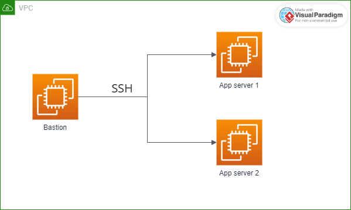

# Configuration of passwordless connection between EC2 instances using terraform

This is a working POC of Terraform passwordless between EC2 instances

## Architecture (server_count=3)



Change the variable ```server_count``` in the **variable.tf** file with the value of application servers you want and enjoy!

```FWNN```